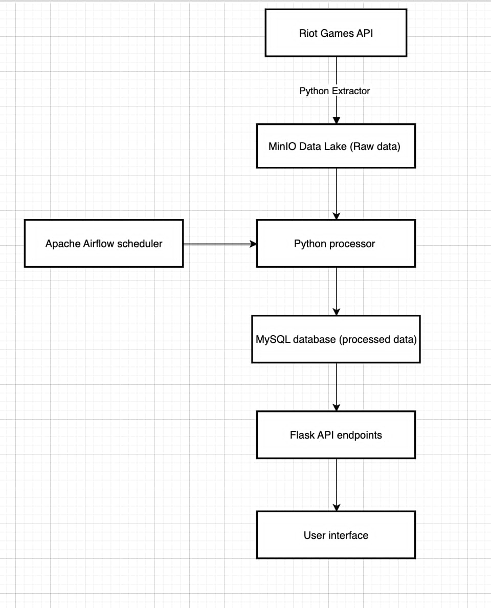
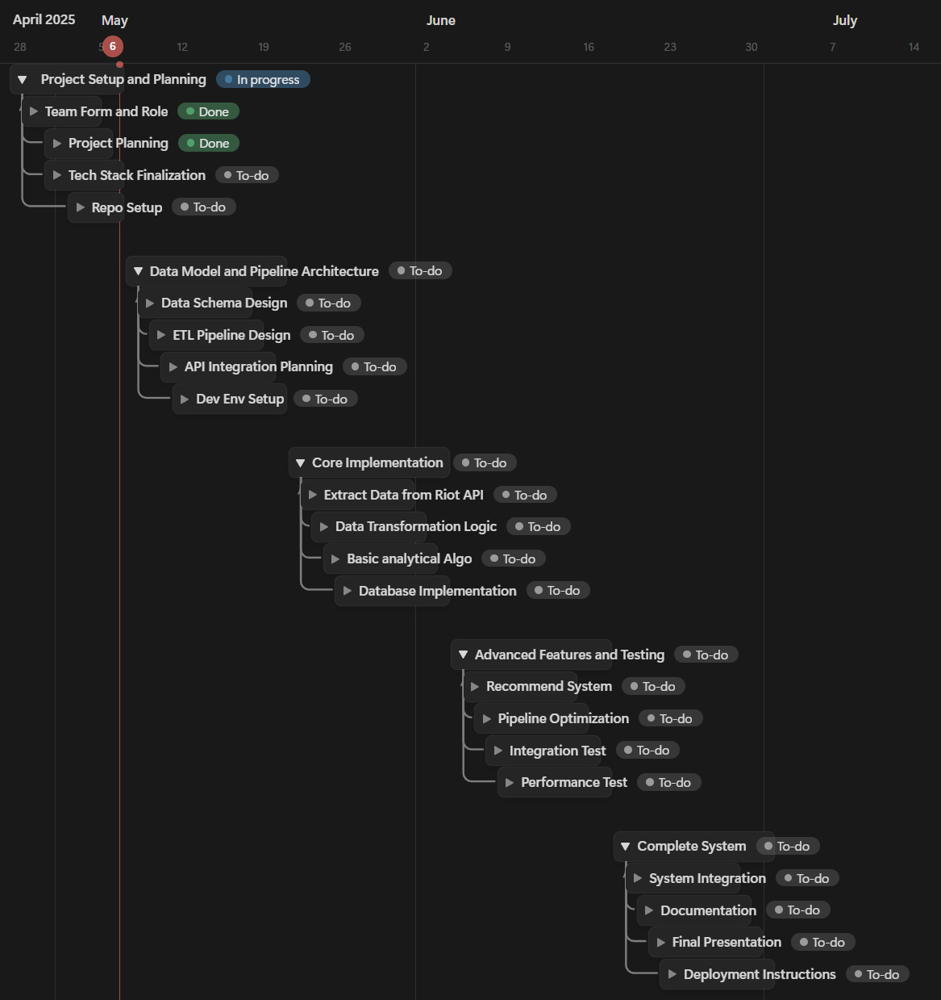

## Database Project: TFT Analyzer

### A. Description:

The Riot Games Analytics Pipeline addresses the challenge faced by players who want to make data-driven decisions but lack access to processed, actionable insights from vast amounts of game data. By ingesting match histories, player statistics, champion/unit performance, and meta trends, our pipeline transforms raw game data into strategic recommendations and performance analytics.

### B. Requirements:
#### B.1. Function Requirements:
- Extract and ingest game data from Riot Games API (match histories, player stats, champion/unit data)
- Process and transform raw data into structured formats suitable for analysis
- Identify patterns, correlations, and insights from game data
- Generate personalized recommendations based on player history and preferences
- Visualize key metrics and insights through dashboards
- Provide timely updates that reflect current game meta and patches
- Allow querying of historical data for trend analysis

#### B.2. Non-function Requirements:
- Scalability to handle large volumes of game data (thousands of matches per hour)
- Low latency for near real-time data processing and insights
- High availability and reliability (>99.5% uptime)
- Data security and compliance with Riot Games API terms of service
- Efficient resource utilization for cost-effectiveness
- Maintainability with clear documentation and modular design
- Configurability to support different game titles (LoL, TFT) and analysis parameters

### C. Planned Core Entities:
- Players: ID, username, rank, region, performance metrics
- Matches: Match ID, timestamp, duration, game version, participating players
- Champions/Units: ID, name, class, attributes, performance metrics
- Items: ID, name, attributes, usage statistics
- Team Compositions: Configuration, win rates, placement statistics
- Meta Trends: Patch information, popularity trends, success rates
- Recommendations: Player-specific suggestions, general strategy recommendations
- Analysis Results: Processed insights, statistical findings

### D. Tech Stack:
- Data Lake: MinIO(open-source S3-compatible object storage) or MongoDB for raw data storage
- Data Storage: MySQL (relational database for structured game data)
- Data Processing: Python with pandas/numpy for data analysis
- Data Orchestration: Apache Airflow for scheduling data updates and processing
- API Integration: Python requests/riotwatcher libraries for Riot Games API
- Backend: Flask for simple API to serve results
- Frontend: Basic HTML/CSS/JavaScript for visualization in web application
- Version Control: Git/GitHub
- Development: Jupyter Notebooks for exploratory analysis and prototyping

Detail Pipeline and Workflow of the System:

### E. Team Members and Roles:
- Luong Tran Sang: Front-end Developer 
- Thai Minh Dung: Data Engineer
- Nguyen Hoang Long: Quality Assessment

### F. Project Timeline
The Gantt Chart show the detail workload of our team through the period time of project:

